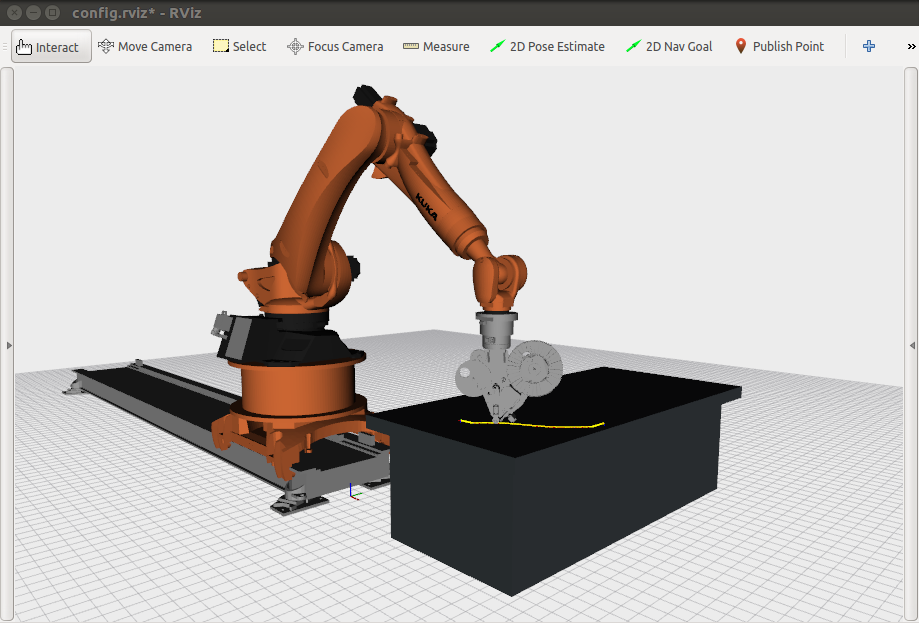

# LayLa

The LayLa (Laying Laminates) framework is a compilation of ROS packages that enables automatic generation of robot trajectories for composite fiber placement. LayLa's main design driver was to allow researchers to effortlessly manufacture composites with a direct implementation of the output of their own fiber tows distribution strategies (this includes for variable stiffness laminates). With an additional post-processing step, a constant laydown speed is hardly imposed, avoiding the superfluous speed variations spotted when tow courses contain curvature changes.




## Input

The user is entitled to modify various parameters via the command-line.

* **path_planner** – The path planner can be selected between "ompl" (RRTConnect by default), "descartes" (Descartes Dense by default) or "trajopt". If not specified, by default it is used "descartes".

* **course_filename** – The file path where the laminate is described. The laminate description has to be arranged in a .txt file with a specific format, exemplified below.

```Layer 1```
```Course 1```
```0.000000 0.388822 0.000000```
```0.014463 0.394463 0.000000```

* **layer** – The number of the layer were the executed tow course is located.

* **course** – The number of the tow course to be executed.

* **exact_waypoints** – If true, the robot trajectory is created with the exact waypoints provided. If false, waypoints are first interpolated with a smooth quintic B-spline and only then the robot trajectory is generated.

* **bezier** – If true, waypoints are interpolated with a single bezier spline. If false, waypoints are interpolated with a smooth quintic B-spline.

* **distance_waypoints** – In case the tow course is interpolated, then the discretization of the new waypoints is made keeping an equal distance and given by the value written in this variable. Given in meters.

* **smooth_start** –  If true, adds an initial and final extension to the tow course, providing smoother accelerations and decelerations at the start and end of the actual tow course.

* **add_x_distance**, **add_y_distance**, **add_z_distance** – The position of the tow course in relation to the robot base may be modified to adjust how close or far the mold surface is to the robot. Given in meters.

* **max_velocity_scaling** – The joints' speed ratio during transport motions. By defaut, this value is kept at 0.1. 

* **ee_speed** – Laydown speed, given in meters per second. By defaut, this value is kept at 0.1. 

## Build Instructions

1) Clone the repository into the respective workspace source folder
2) Clone the repositories in the dependencies.rosinstall file using wstool or manually to the source folder
4) Execute rosdep for the remaining ROS dependencies
5) Build the workspace using catkin built

## Launch

Each time Layla is executed, the robot trajectory corresponding to a single tow course is generated.
To launch LayLa use the next command.

```roslaunch layla_utilities layla_motion_planning_pipeline.launch```

To modify inputs variables, either change directly on the launch file or use the command-line as exemplified below. 

```roslaunch layla_utilities layla_motion_planning_pipeline.launch layer:=1 course:=1```


